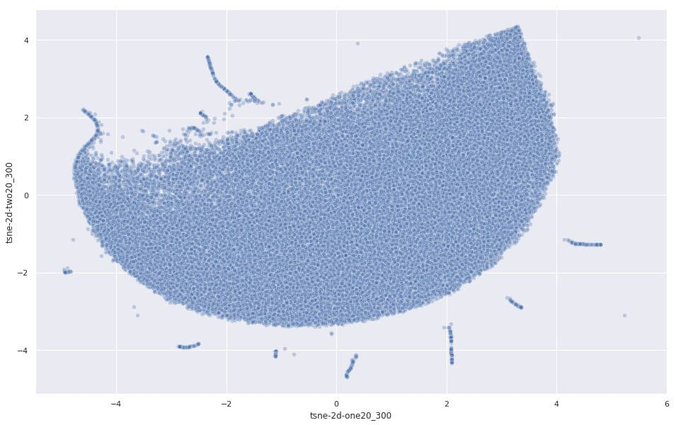
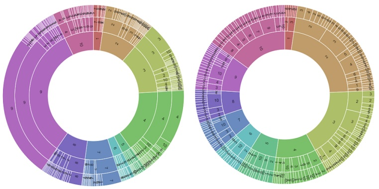

This project is started in summer 2019 and includes the following steps:

* Designing an MCDM framework provides monthly water consumption prediction for consumers 
* Designing water meter replacement plan using anomaly detection methods

  

 This water consumption prediction framework uses the following parameters,

1. Meteorological parameters
2. Network properties (such as point-based pressure, water quality, and water taste)
3. Water sources 
4. Calendar and working days
5. History of consumption (for every consumer), 
6. Consumers pipeline properties (e.g., pipeline's diameter, input pressure)
7. Pricing history and inflation

   A Set of mentioned parameters are collected for >76000 municipal water consumers of Yazd city. Data includes a data-frame of >15,000,000 records and 450 parameters. Records are preprocessed, and their key features are extracted and normalized. Finally, the future consumption values are predicted using a piecewise Quantile Regression. The regressor's cutting thresholds are automatically extracted and applied. 

The second framework tries to detect faulty water meters using ensemble outlier detection methods applied on sequences of water consumption. The proposed framework extracts 14-month times series of registered values and discretizes them to symbolic values using SAX time series representation. During the data investigation step, we found that degraded meters lost their sensitivity and the mean and standard deviation (STD) values of their registered values are converged. By tracking the changes in the mean/STD values of the registered values and applying the outlier detection methods, a list of suspicious meters is extracted. While meters have not been labeled as faulty/normal, we combine diverse outlier detection methods through ensemble methods to find a list of meters that are more likely to be considered defective.  [Ref. to <https://fkavehy.netlify.app/publication/water-meter-replacement-recommendation-for-municipal-water-distribution-networks-using-ensemble-outlier-detection-methods/> for details of the framework]